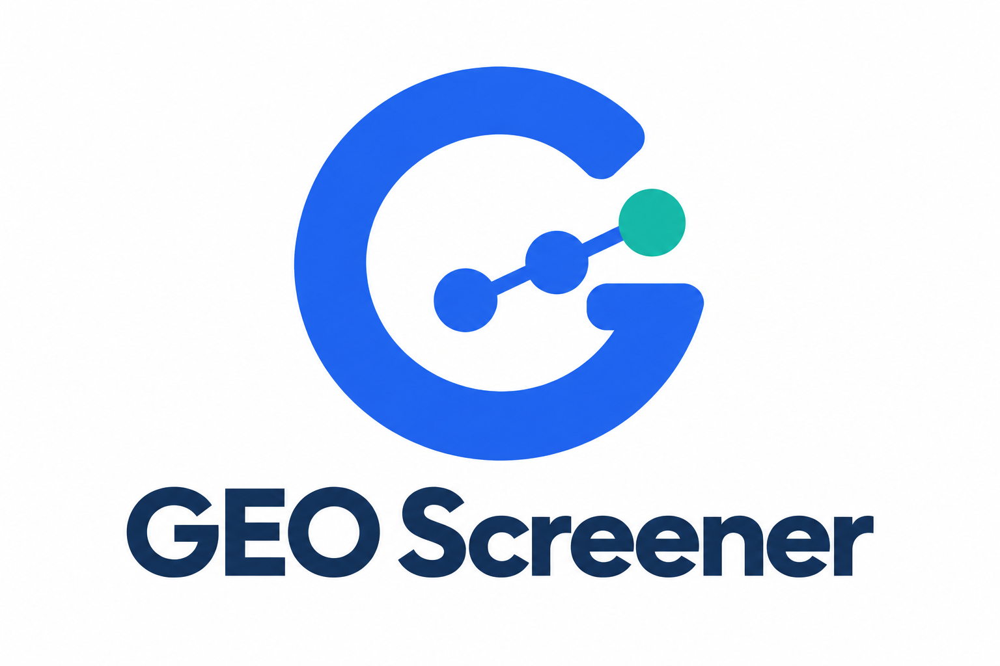
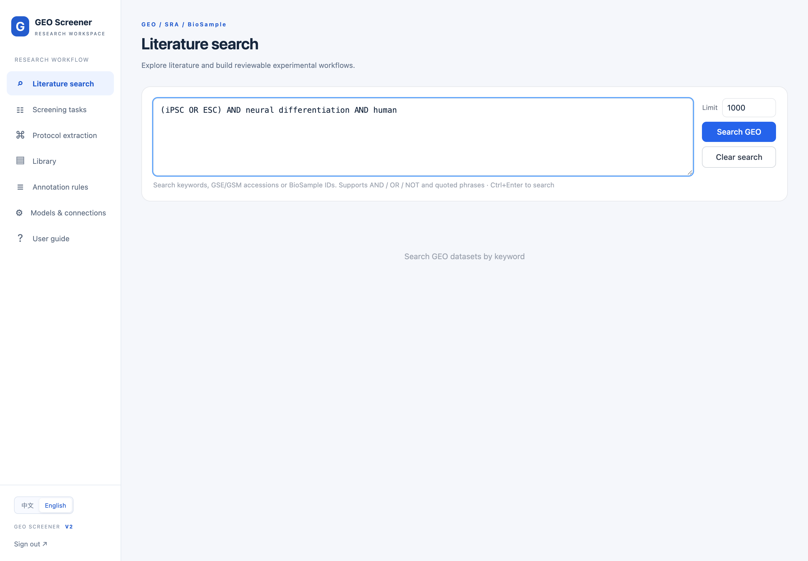
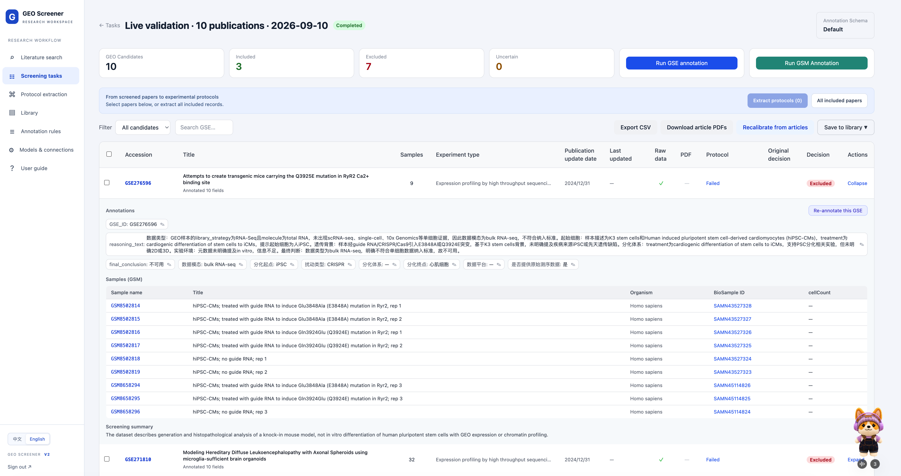
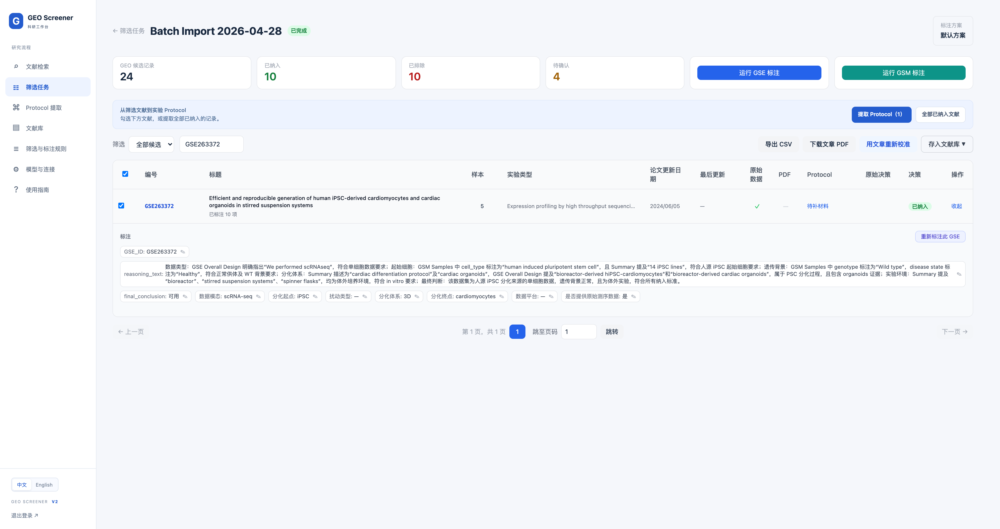
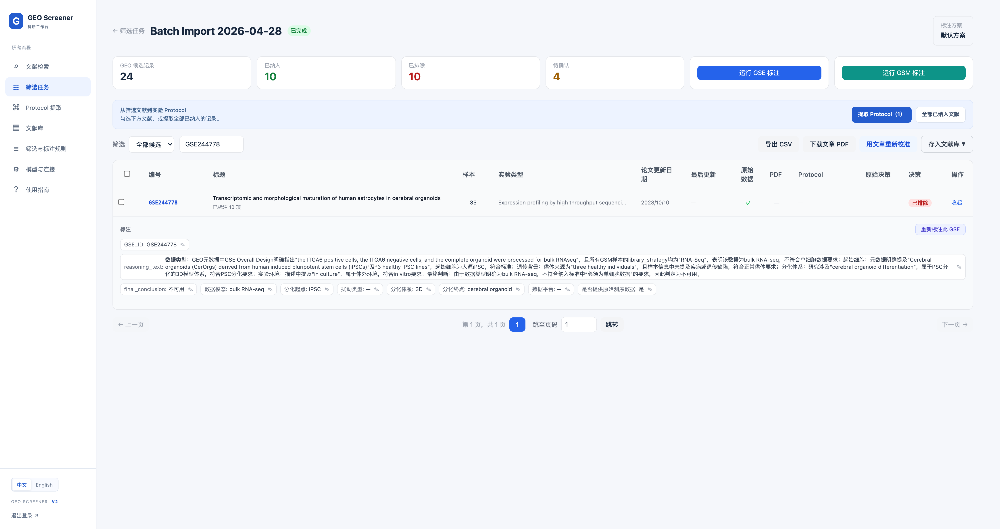
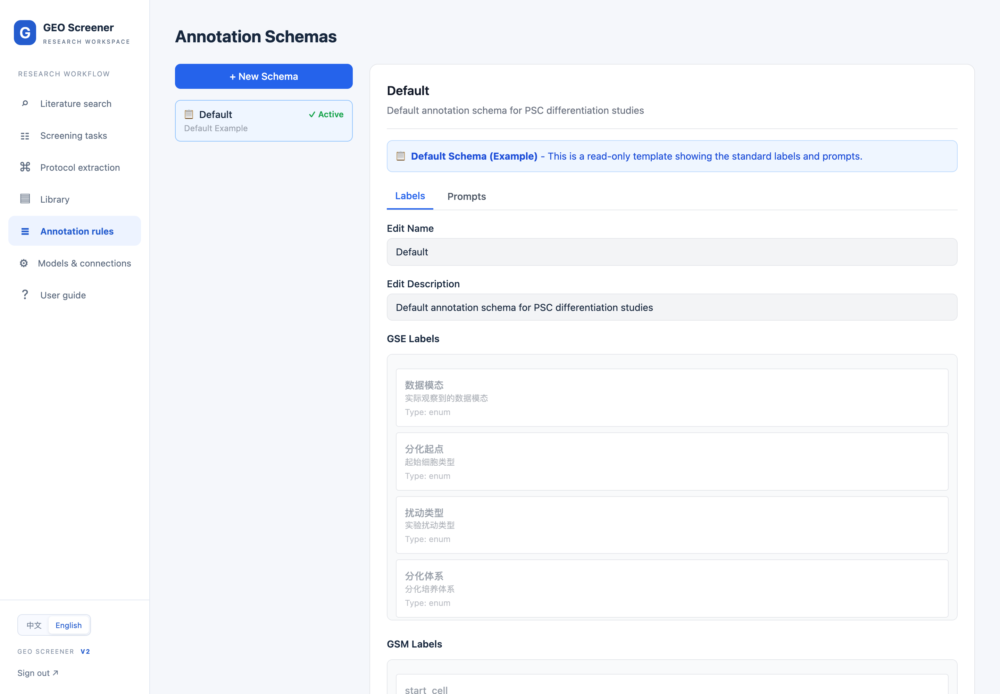
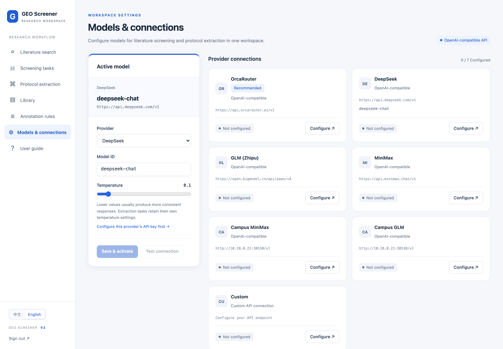
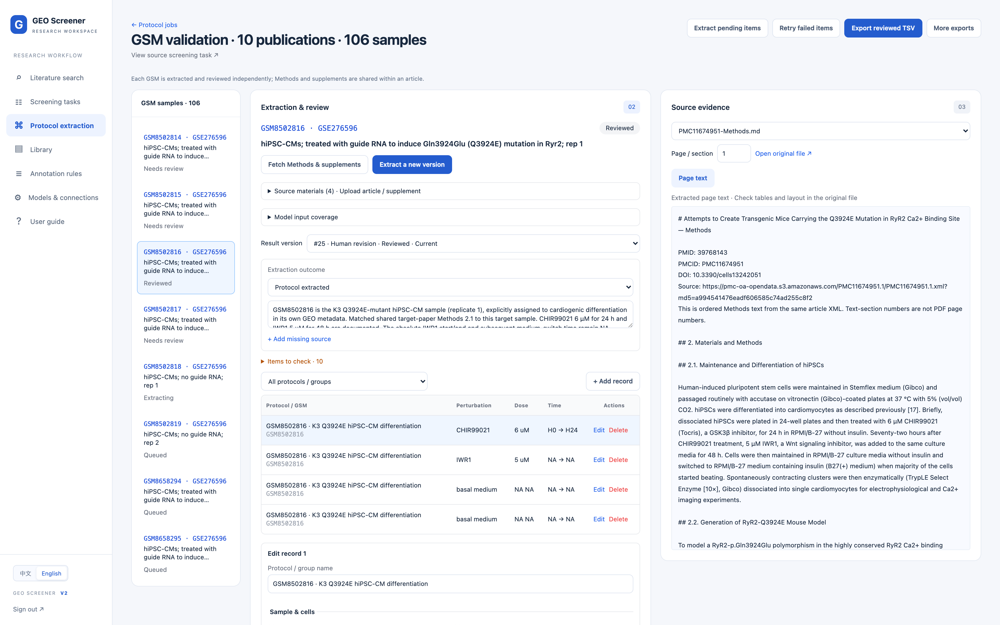
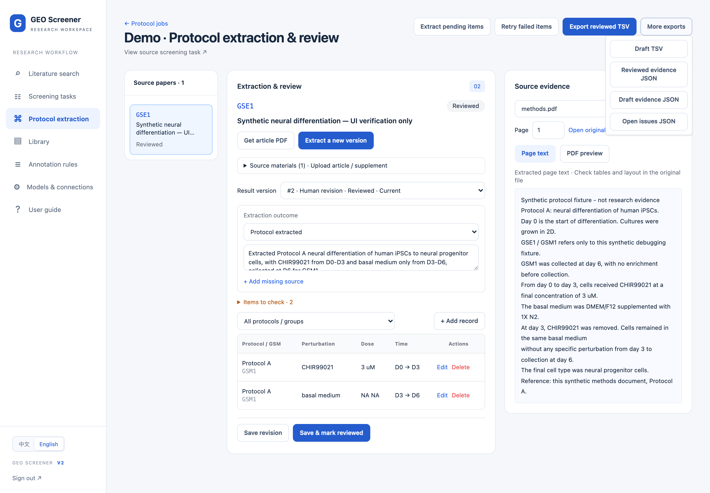
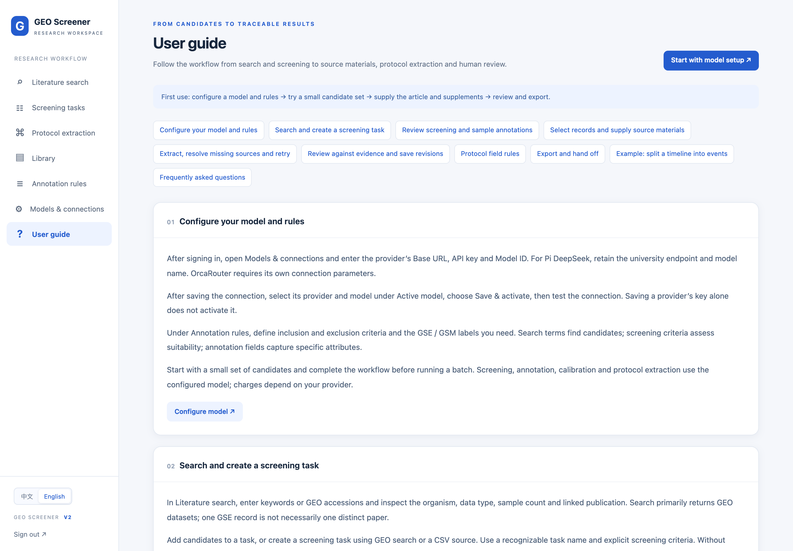

<div align="center">

# GEO Screener v2



**From GEO dataset screening to evidence-backed protocol extraction**

Search → Screen → Annotate → Collect sources → Extract → Review → Export

**English** · [简体中文](README.zh-CN.md)

</div>

GEO Screener is a self-hosted research workspace for finding GEO datasets, screening them against your criteria, annotating GSE/GSM records, and extracting structured experimental protocols from associated papers. v2 preserves the original screening, library and CSV workflows and adds source materials, page evidence, human revisions and protocol exports.

> v2 is developed on `codex/v2-protocol`. The starting v1 snapshot is preserved as `v1-baseline-20260910`. Use a separate v2 data directory; see [installation](#installation) and [migration details](docs/V2_PROTOCOL.md).

## What's in v2

| Capability | What you can do |
|---|---|
| GEO search and screening | Search keywords/accessions or import CSV; assess candidates against natural-language inclusion criteria. |
| GSE / GSM annotation | Define dataset- and sample-level labels, inspect decisions, and save manual corrections. |
| Protocol workspace | Select screened records, organize articles/supplements/cited methods, and extract treatment events. |
| Evidence and review | Inspect source pages, edit groups, doses and time windows, retain revision history, and resolve missing sources. |
| Exports | Download screening CSV, reviewed or draft protocol TSV, evidence JSON and issues JSON. |
| Models | OrcaRouter is listed first and marked **Recommended**; DeepSeek and other OpenAI-compatible connections remain available. |
| Bilingual interface | Switch 中文 / English in the sidebar; the selected language is remembered. |
| Built-in guide | Follow the complete workflow, field rules, examples and troubleshooting in either language. |

## Interface tour

These are screenshots of the running v2 interface. The main screening image is the user's original **4480 × 2370 PNG**; the other images were captured directly in headless Chrome at **2× pixel density** (2880 × 2000 for demo pages, 3840 × 2400 for the real protocol workspace, or 4480 × 2370 for the expanded screening examples). No images were upscaled. Click an image to inspect the original.

Screening views show real saved records. The GSM workspace shows a real, independently reviewed sample from the ten-publication validation cohort. The export-menu image uses synthetic `GSE1`/`GSM1` demo fixtures. Neither screenshot is a substitute for checking applicability and missing experimental details. No login credentials or API keys are shown. Interface switching preserves the original language of research content. [Capture details](docs/images/v2/README.md). [Ten-publication live validation](docs/V2_LIVE_VALIDATION.md) records actual results and remaining limitations.

### 1. Search GEO candidates

Enter keywords or accession identifiers and set a result limit. This screenshot shows a prepared query before submission; it does not imply that a live search returned the demo study.



### 2. Review screening and select papers

Inspect inclusion counts and annotation status, export CSV, download article PDFs, or send selected records to protocol extraction. “All included papers” includes accepted records across all task pages.



This user-selected screenshot shows the ten-publication validation task with an expanded exclusion reason and GSM sample metadata. It records an intermediate state: **Completed** refers to screening/annotation; the visible protocol **Failed** states are historical extraction failures from the earlier run. See the validation report for the subsequent fixes and GSM workflow.

<details>
<summary>More real examples: why a study was included or excluded</summary>

**Included — GSE263372:** the saved assessment cites human iPSC-derived cardiomyocytes/organoids, scRNA-seq, a healthy wild-type background and in vitro culture.



**Excluded — GSE244778:** although it uses human iPSC-derived cerebral organoids, the experiment is bulk RNA-seq and does not meet this task's single-cell requirement. Exclusion means unsuitable for these criteria, not poor study quality. These are saved model judgments for human review.



</details>

### 3. Define annotation rules

Use the read-only default schema as a reference and create a schema for your research question. GSE labels, GSM labels and prompts are configured together.



### 4. Configure a model

OrcaRouter appears first with a recommendation badge. Saving a provider connection and activating a model are separate actions; the demo has no configured keys and shows the default DeepSeek selection.



### 5. Review protocol events and revisions

Each GSM has its own protocol and review state. This real example, GSM8502816, combines its GEO metadata with article Methods and cited evidence. Unknown absolute timings remain NA. Re-extraction retains the active human revision and adds a new machine proposal.



### 6. Check evidence and export

Inspect page text or the PDF preview and open the original material to check table layout. A matched quote establishes provenance; it does not establish the biological correctness of every extracted field.



### 7. Follow the bilingual guide

The in-app guide covers setup through export, with protocol field rules, a time-window example and common failure cases. Open **User guide** in the sidebar after login.



[View the Chinese guide screenshot](docs/images/v2/guide-zh.png) · [Screenshot provenance](docs/images/v2/README.md)

## Installation

Run commands from the repository root. Use Python **3.11** for the tested release setup; Docker also uses Python 3.11. Network access is needed for dependencies, GEO queries and your model provider.

### 1. Get v2 and install dependencies

```bash
git clone --branch v2.0.0 https://github.com/lzzsh/GEO_Screener.git
cd GEO_Screener
python3 -m venv .venv
source .venv/bin/activate
python -m pip install -r backend/requirements.txt
```

### 2. Prepare data — choose one option

**Fresh installation:** run this once. It refuses to overwrite an existing `data/v2` directory.

```bash
python - <<'PY'
from pathlib import Path
import shutil
import sqlite3

root = Path('data/v2')
root.mkdir(parents=True, exist_ok=False)
for name in ('pdfs', 'protocols'):
    (root / name).mkdir()
shutil.copytree('backend/prompts', root / 'prompts')
sqlite3.connect(root / 'geo_search.db').close()
PY
```

**Copy an existing v1 installation:** instead of the fresh-install block, use the actual database and PDF paths from your v1 deployment.

```bash
python scripts/prepare_v2.py --source-db geo_search.db --source-pdfs pdfs
```

For a v1 Docker deployment, the database may be `data/geo_search.db`; adjust both source paths as needed. The script backs up SQLite, checks integrity, copies prompts/PDFs and creates separate v2 storage. It refuses an existing destination, so do not create `data/v2` beforehand. Existing accounts and settings are carried over. If an old cached PDF path no longer resolves in v2, reacquire or upload that article.

### 3. Start locally

```bash
python scripts/run_v2.py
```

Open [GEO Screener](http://127.0.0.1:8002). The launcher uses private v2 data/prompts and creates a persistent signing key at `data/v2/.secret_key`. Local tasks run in the web process; Redis is not required for this mode.

### 4. Create an account

Fresh installations do not create default accounts. In another terminal, replace the example values and register:

```bash
curl -X POST http://127.0.0.1:8002/auth/register \
  -H 'Content-Type: application/json' \
  -d '{"username":"researcher","email":"you@example.org","password":"replace-with-a-strong-password"}'
```

Then sign in through the website. Migrated users can keep their existing credentials.

### Docker alternative

Prepare `data/v2` using one of the options above, then create `docker/.env` with a persistent `SECRET_KEY`. The following command creates the file once and refuses to overwrite it; if it already exists, retain it and ensure it contains a valid `SECRET_KEY`.

```bash
(umask 077; python - <<'PY'
import secrets
from pathlib import Path
with Path('docker/.env').open('x') as file:
    file.write('SECRET_KEY=' + secrets.token_urlsafe(48) + '\n')
PY
)
docker compose -p geo-v2 -f docker/docker-compose.v2.yml up -d --build
```

Do not run the local launcher and Docker on port 8002 simultaneously. Docker starts web, Celery worker and Redis services, binds the website to localhost, and keeps its Redis volume separate from v1. Register a fresh account as above if needed. Container build/deployment was not part of the recorded local regression run.

## Model configuration

1. Open **Models & connections**. OrcaRouter is the first, recommended provider; choose it or another supported connection.
2. Configure the provider's **Base URL**, **API Key** and **Model ID**, then save the connection.
3. In **Active model**, select the provider/model and click **Save & activate**.
4. Test the connection, then try a small screening/extraction job before a large batch.

Defaults shipped with this version for OrcaRouter are `https://api.orcarouter.ai/v1` and `orcarouter/auto`; use the parameters issued for your account if different. A Pi/campus DeepSeek connection must use its own supplied endpoint and model ID. OrcaRouter needs no dedicated SDK because it uses the existing OpenAI-compatible provider interface.

You may register through the [GEO Screener OrcaRouter referral link](https://www.orcarouter.ai/ref/ref_3c070f5c24f3119666e7). This is optional; the maintainer may receive a commission from qualifying referred usage under OrcaRouter's referral rules. Other providers remain usable.

## End-to-end workflow

1. **Define the research question.** Set inclusion/exclusion criteria and GSE/GSM annotation fields. Search keywords discover candidates; screening criteria determine suitability.
2. **Search or import.** Create a screening task from GEO candidates or CSV. A GSE is a dataset, not necessarily a unique paper. Saving candidates without criteria is not a completed suitability assessment.
3. **Review and annotate.** Inspect included/excluded/uncertain decisions and sample annotations; correct them where necessary. Save useful records to the library or export screening CSV.
4. **Select sources.** Choose records in the task and create a protocol job. Use **Fetch Methods & supplements**, or upload the correct main article, supplements and cited methods. The coverage list shows the material supplied to the model.
5. **Extract.** Run a single item or batch pending items. If the result needs additional sources, supply those materials and retry. “No protocol found” refers only to the available material.
6. **Review against evidence.** Check groups, GSM mapping, working concentrations, time windows and source quotes. Resolve blocking errors before saving as reviewed.
7. **Export and retain provenance.** Export reviewed TSV together with evidence/issue JSON and keep the source materials. Draft TSV is a separate export.

The original “Recalibrate from articles” action re-evaluates screening using article content. It is separate from protocol extraction and is not an accuracy benchmark. Protocol extraction does not overwrite screening decisions or labels.

## PDF and protocol rules

| Topic | Rule |
|---|---|
| Materials | PDF, UTF-8 TXT or MD; maximum **30 MB/file**, **300 pages/PDF**, **20 materials/source record**. |
| PDF retrieval | Reuse an existing PDF or resolve an explicit GEO publication link. Multiple article associations require you to identify the correct article; download availability is not guaranteed. |
| Supplements and citations | Upload missing methods and state the citation/adoption relationship. Target-paper modifications take precedence over the generic cited recipe. |
| Event rows | One perturbation event per group/sample and time window. Separate groups, doses and windows. |
| Missing values | Use `NA`. Leave unknown GSM mappings and unsupported PubChem/ChEMBL IDs as `NA`. |
| Doses and medium | Record final working concentration, not stock concentration. Keep constant supplements in `Culture_medium`. For basal-medium-only rows, use `Addition_context=basal medium` and `Pert_name=NA`. |
| Time | Use `days` or `hours`; duration is end minus start. Match D/H prefixes to units; do not invent ambiguous endpoints. |
| Review | Every event needs supporting page evidence. Machine drafts require human review; reviewed status is not experimental validation. |

The extraction contract is adapted from `perturbation-extractor` and `protocol-chain-annotator`, with versioned prompts and source provenance. Users do not need to install those skills separately to run the web application.

<details>
<summary>Protocol TSV: fixed 24-column order</summary>

```text
GSE_id, GSM_id, Article_title, Start_cell_type, Final_cell_type,
Stage_name, Stage_order, Pert_name, Addition_context, Pert_type,
pubchem_cid, chembl_id, dose_value, dose_unit, time_pert_start,
time_pert_end, duration_pert, time_unit, time_collection,
Culture_medium, Culture_system, Batch_id, Collection_methods, Reference
```

Actual TSV files use tabs. Evidence and issues are exported separately, preserving the 24-column contract. See [field validation](backend/protocol_schema.py) and the in-app guide for accepted enum values.

</details>

## Data, limits and troubleshooting

The database, downloaded PDFs, uploaded sources and prompt copies live under `data/v2/`. API keys are stored in the local database; the application does not promise encrypted-at-rest credential storage. Metadata and source text are sent to the configured model provider for relevant tasks; public search and article retrieval also contact external services. Model charges depend on your provider.

- **PDF unavailable or unreadable:** verify PMID/DOI and upload the correct article/supplement. Scanned PDFs need external OCR first; automatic OCR is not implemented.
- **Supplementary methods:** upload DOCX, XLSX, CSV, TSV or ZIP directly. Text, recipe tables and worksheets are extracted with source references. Image-only content still needs OCR or manual review.
- **Missing cited methods:** supply them manually. External citation-chain retrieval and chemical identifier lookup are not automated.
- **Cannot mark reviewed:** resolve blocking field, time, evidence or missing-source issues. Genuine unknowns may remain `NA` where allowed.
- **Export is empty:** the default TSV includes only current reviewed revisions. Use the explicit draft export for unreviewed work.
- **Interrupted extraction:** local in-process jobs do not survive a server restart. Stale items can be retried after the 20-minute lease expires.

No biological accuracy benchmark is claimed. Source matching and structural validation do not replace scientific review. To return to v1, stop v2 and use the original deployment/database; do not run v1 against the migrated v2 database.

## Development and validation

FastAPI · async SQLAlchemy / SQLite · Celery / Redis · Jinja2 / Alpine.js / Tailwind CSS · OpenAI-compatible APIs

```bash
python -m pytest -c backend/pytest.ini backend/tests -q
node --test frontend/tests/ui.test.cjs
```

The recorded local regression run on 2026-09-10 passed **107 backend tests** and **8 frontend tests**. Existing warnings remain. LLM/download responses in those regression tests are mocked; the screenshots illustrate UI behavior, not scientific accuracy or publisher availability. Details: [legacy debugging](docs/LEGACY_DEBUGGING.md), [v2 validation](docs/V2_VALIDATION.md), [UI changes](docs/UI_REFRESH.md), [protocol design and limits](docs/V2_PROTOCOL.md).

## Contact, license and citation

Questions and suggestions are welcome via WeChat:


[MIT License](LICENSE).

```bibtex
@software{geoscreener2026,
  title  = {GEO Screener: LLM-powered Dataset Curation for GEO},
  author = {Liao, Zizhuo},
  year   = {2026},
  url    = {https://github.com/lzzsh/GEO_Screener}
}
```


### GSM-specific protocol extraction

New jobs expand selected studies into GSM samples. Each GSM gets its own protocol, source evidence, revisions and review status. Full GEO sample metadata is matched with shared Methods, supplements and explicitly adopted reference protocols. Unknown mappings remain unresolved; `GSM_id=NA` cannot enter reviewed exports. Existing article-level jobs remain available as legacy results.

The ten-publication cohort contains 106 GSM samples. Following the requested small validation scope, eight GSMs completed processing: six returned extracted drafts and two retained missing-source status. One GSM completed source review and reviewed TSV export; remaining attempts were stopped. See the [live validation report](docs/V2_LIVE_VALIDATION.md) for measured coverage and remaining gaps.

### Default prompts for new installations

The release includes default GSE/GSM annotation prompts, the article-calibration template, the Protocol extraction contract and both protocol skill documents. No personal Codex skill installation or developer files are required. Prompt loading prefers a non-empty private schema override, then a private default, then the bundled default. New schemas inherit defaults until edited. GSM identity rules always load from the release, including when an older private Protocol prompt is retained.

The default annotation criteria concern human PSC differentiation and single-cell data; review them for your research question. Fresh installations contain no account or API key. Configure your own provider before real model calls. The Docker v2 setup stores private overrides under `/data/prompts` while retaining bundled defaults in the image.
