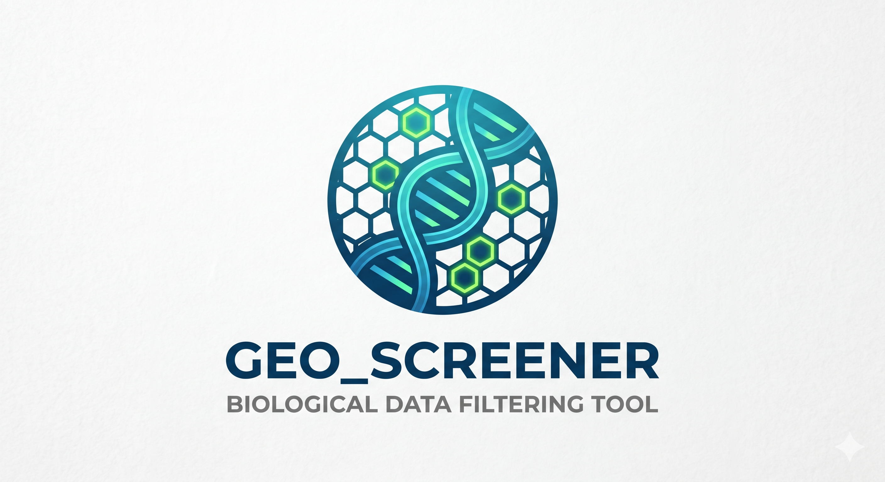
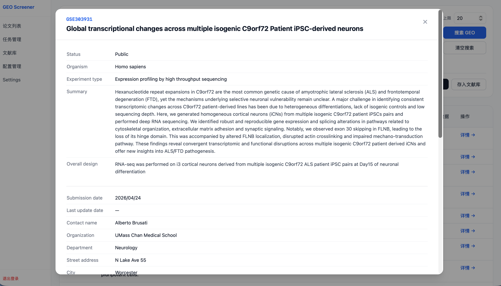
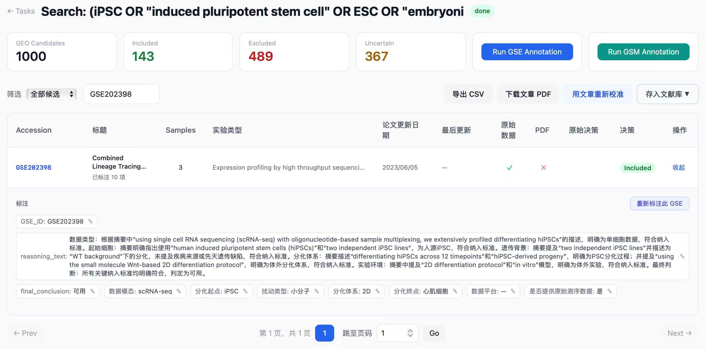
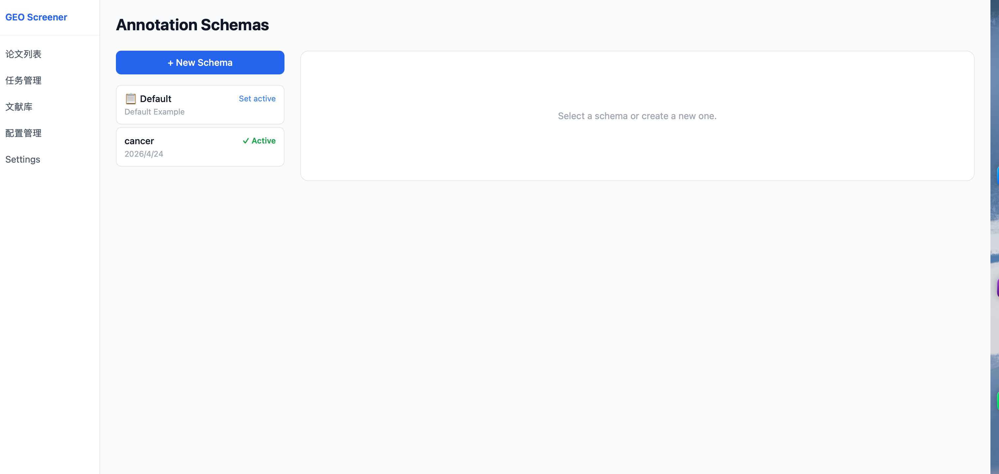
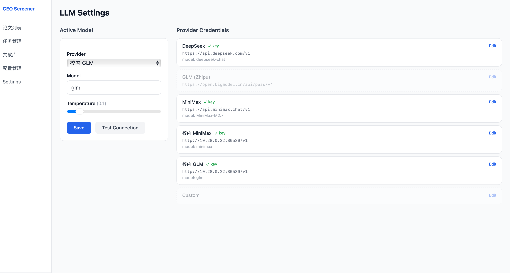

<div align="center">

# 🧬 GEO Screener



**LLM-powered dataset curation for GEO**

🔍 Search · 🤖 Screen · 🏷️ Annotate · 📤 Export

*Configurable schemas · OpenAI-compatible · Docker-ready · Self-hosted*

</div>

---

GEO Screener turns the tedious process of systematic GEO dataset curation into a structured, LLM-assisted workflow. Define your inclusion criteria once, run batch screening across hundreds of datasets, drill into sample-level annotation, and export clean results — all from a web UI.

## ✨ Features

| | |
|---|---|
| 🔍 **GEO Search** | Query by keyword, GSE/GSM accession, or BioSample ID |
| 🤖 **Batch Screening** | LLM evaluates each dataset against your criteria: include / exclude / uncertain |
| 🏷️ **GSE Annotation** | Extract structured metadata fields defined by your schema |
| 🔬 **GSM Annotation** | Sample-level annotation with custom label definitions |
| 📐 **Annotation Schemas** | Create and switch schemas per research question; set one as globally active |
| ✏️ **Manual Override** | Edit any LLM decision or label inline; changes sync task statistics immediately |
| 📊 **Paper Calibration** | Measure LLM accuracy against manually reviewed papers |
| 📚 **Library** | Save datasets to named collections for downstream use |
| 📤 **Export** | Download results as CSV with manual overrides applied |

---

## 📸 Screenshots

**🔍 Search**



Query NCBI GEO by keyword or accession. Results show dataset type, sample count, raw data availability, and publication date.

---

**🏷️ GSE Annotation**



LLM extracts structured fields from each dataset according to your active schema. Labels are editable inline; human edits are preserved across re-annotation runs.

---

**📐 Annotation Schema Configuration**



Define GSE and GSM label fields (enum or free-text), set one schema as active, and all new tasks inherit it automatically.

---

**⚙️ LLM Configuration**



Connect any OpenAI-compatible provider — OpenAI, DeepSeek, Qwen, local Ollama, etc. API keys are stored only in the local database and never committed to git.

---

## 🚀 Quick Start (Docker)

**Prerequisites:** Docker and Docker Compose.

```bash
git clone https://github.com/lzzsh/GEO_Screener.git
cd GEO_Screener

cp docker/.env.example docker/.env
# Edit docker/.env — set SECRET_KEY and your LLM credentials

mkdir -p data pdfs
docker compose -f docker/docker-compose.yml up -d
```

Open [http://localhost:8000](http://localhost:8000) — the UI will prompt you to log in, but there are no accounts yet. Register your first account via the API:

```bash
curl -s -X POST http://localhost:8000/api/auth/register \
    -H "Content-Type: application/json" \
    -d '{"username":"admin","password":"admin123"}'
```

Then log in with those credentials and go to **Settings** to configure your LLM provider.

### 🔑 Environment variables

| Variable | Required | Description |
|---|---|---|
| `SECRET_KEY` | ✅ Yes | Random string for JWT signing — change before deploying |
| `DATABASE_URL` | No | Defaults to `sqlite:////data/geo_search.db` |
| `REDIS_URL` | No | Defaults to `redis://redis:6379/0` |

LLM credentials (provider, API key, model, base URL) are configured through the **Settings** page in the UI, not via environment variables.

---

## 📐 Annotation Schemas

A schema defines what fields the LLM extracts from each GSE dataset and each GSM sample. You can maintain multiple schemas for different research questions and switch between them at any time.

### Creating a schema

1. Go to **Criteria** in the top navigation.
2. Under **Annotation Schemas**, click **+ New Schema**.
3. Define **GSE labels** — dataset-level fields (e.g. sequencing modality, cell type, differentiation endpoint).
4. Define **GSM labels** — sample-level fields (e.g. passage number, treatment condition).
5. Each label has a name, type (`enum` or `free_text`), and optional allowed values.
6. Click **Save**.

### Setting the active schema

Click **Set active** next to any schema. A **✓ Active** badge appears, and all new tasks you create will automatically use that schema.

To revert to the built-in default, click **Set active** on the **Default** entry.

> ⚠️ If you run GSM annotation with a schema that has no GSM labels defined, the task will fail immediately with a clear error message rather than silently using defaults.

### Custom prompt templates

Each schema can have its own LLM prompt files:

```
backend/prompts/<schema-name>/label_prompt.txt        # GSE annotation
backend/prompts/<schema-name>/gsm_label_prompt.txt    # GSM annotation
```

If a schema-specific file is missing, the system falls back to `backend/prompts/default/`. Copy and edit the default prompts as a starting point. The `{gse_label_spec}` / `{gsm_label_spec}` placeholders are filled automatically from your schema definition.

---

## 🔄 Workflow

```
🔍 Search GEO  →  📋 Create screening task  →  👀 Review decisions
                                                       ↓
                                          🏷️ Annotate GSE (LLM extracts labels)
                                                       ↓
                                          🔬 Create GSM annotation task
                                                       ↓
                                          ✏️ Review & override  →  📤 Export CSV
```

---

## 🛠️ Tech Stack

| Layer | Technology |
|---|---|
| 🖥️ Backend | FastAPI, SQLAlchemy (async), SQLite |
| ⚙️ Task Queue | Celery + Redis |
| 🤖 LLM | OpenAI-compatible API (any provider) |
| 🎨 Frontend | Jinja2, Alpine.js, Tailwind CSS |
| 🔐 Auth | JWT (python-jose + passlib) |

---

## ⚠️ Safety & Disclaimer

- **Research use only** — GEO Screener is a literature curation aid, not a validated clinical or diagnostic tool
- **Verify LLM outputs** — Always review automated screening decisions before drawing scientific conclusions
- **Local-first** — All data stays on your machine; no dataset content is sent to external services beyond your configured LLM provider

---

## 📬 Contact

如有问题或建议，欢迎通过微信联系：


---

## 📜 License

MIT License — see [LICENSE](LICENSE) for details.

---

## 📝 Citation

If you use GEO Screener in your research, please cite:

```bibtex
@software{geoscreener2026,
  title  = {GEO Screener: LLM-powered Dataset Curation for GEO},
  author = {Liao, Zizhuo},
  year   = {2026},
  url    = {https://github.com/lzzsh/GEO_Screener}
}
```
