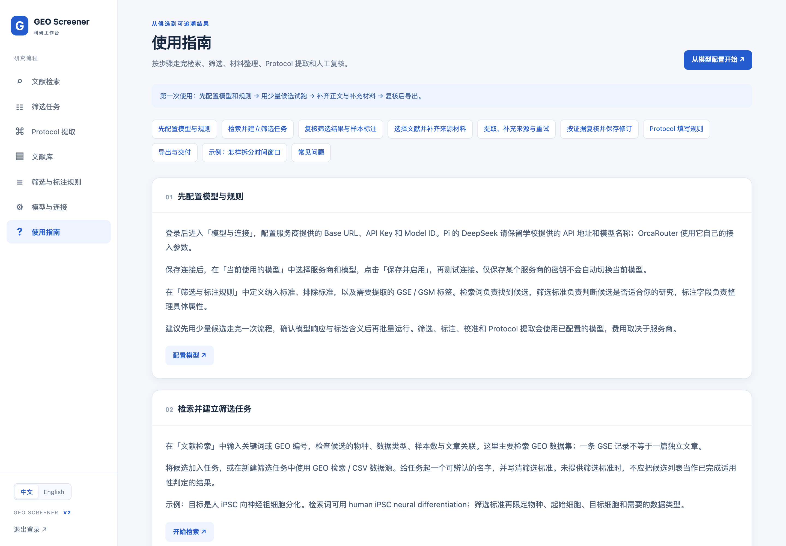

<div align="center">

# GEO Screener v2


**从 GEO 数据集筛选，到有原文证据的实验 Protocol 提取**

检索 → 筛选 → 标注 → 整理材料 → 提取 → 人工复核 → 导出

[English](README.md) · **简体中文**

</div>

GEO Screener 是一个可自行部署的科研工作台，用于检索 GEO 数据集、按研究标准筛选候选、标注 GSE/GSM，并从关联文章中提取结构化实验 Protocol。v2 保留原有筛选、文献库和 CSV 导出功能，新增来源材料管理、逐页证据、人工修订和 Protocol 导出。

> v2 开发分支为 `codex/v2-protocol`，起始 v1 快照保留为 `v1-baseline-20260910`。v2 使用独立数据目录；请按下方安装步骤操作，迁移细节见 [v2 说明](docs/V2_PROTOCOL.md)。

## 第二版提供什么

| 功能 | 可以完成的工作 |
|---|---|
| GEO 检索与筛选 | 按关键词或编号检索，也可导入 CSV；用自然语言标准判断候选是否适合研究。 |
| GSE / GSM 标注 | 分别定义数据集和样本层级字段，检查模型判断，保存人工修正。 |
| Protocol 工作台 | 从筛选结果选择来源，整理正文、补充材料和引用方法，提取扰动事件。 |
| 证据与复核 | 查看来源页，修改实验组、剂量和时间窗口，保留修订版本，补齐缺失来源。 |
| 结果导出 | 筛选 CSV、已复核或草稿 Protocol TSV、证据 JSON、待确认项 JSON。 |
| 模型配置 | **OrcaRouter 排在首位并标记为推荐**，同时支持 DeepSeek 等 OpenAI-compatible 服务。 |
| 中英文界面 | 侧边栏切换中文 / English，并记住选择。 |
| 内置使用指南 | 按完整流程介绍操作、字段规则、时间窗口示例与常见问题。 |

## 网页功能截图

以下为实际运行的 v2 网页截图。筛选主图使用用户提供的 **4480 × 2370 原始 PNG**；其他图片由无头 Chrome 以 **2 倍像素密度**直接截图（演示页为 2880 × 2000，真实 GSM 工作台为 3840 × 2400，展开的筛选例子为 4480 × 2370），未放大旧图。点击图片可查看原图。

筛选部分展示真实保存的记录；GSM 工作台展示真实样本的独立复核结果；导出菜单图中的 `GSE1`、`GSM1` 为演示数据。截图不能替代对实验适用性和缺失条件的核对。截图不包含登录凭证或 API Key。切换界面语言会保留研究内容的原始语言。[截图来源与尺寸](docs/images/v2/README.md)。 [十篇真实文献流程验证](docs/V2_LIVE_VALIDATION.md)单独记录实际结果及尚存限制。

### 1. 检索 GEO 候选

输入关键词或编号，设置返回数量。截图展示提交前的查询输入，未将虚构演示记录冒充实时检索结果。


### 2. 复核筛选结果，选择待提取文献

查看纳入数量和标注状态，导出 CSV、下载文章 PDF，或将选中的记录送入 Protocol 工作台。「全部已纳入文献」包含任务所有分页中的纳入记录。


这张用户指定的截图展示十篇文献验证任务，展开了排除理由和 GSM 样本信息。它记录的是验证过程中的状态：**Completed 仅表示筛选／标注完成**，图中 Protocol 的 **Failed** 属于独立的提取失败状态，不能理解为已完成提取。

<details>
<summary>更多真实例子：为什么纳入，为什么排除</summary>

**纳入 — GSE263372：** 已保存的判断依据包括人源 iPSC 分化的心肌细胞／类器官、scRNA-seq、健康野生型背景和体外培养。


**排除 — GSE244778：** 虽然采用人源 iPSC 来源的脑类器官，但实际实验为 bulk RNA-seq，不符合该任务的单细胞数据要求。排除表示不适合当前研究标准，不代表研究质量差。这些是供人工复核的已有模型判断。


</details>

### 3. 配置研究规则

参考只读的默认模板，为自己的研究问题创建标注方案，并配置 GSE 标签、GSM 标签和提示词。


### 4. 连接模型服务

OrcaRouter 位于第一位并标为推荐。保存服务商连接后，还需选择当前模型并启用；截图中的演示环境未配置密钥，左侧展示默认 DeepSeek 选择。


### 5. 复核 Protocol 事件和版本

将实验组、扰动和时间窗口分行整理，检查缺失信息，保存人工修订。重新提取会增加机器提案，并保留当前人工版本。


### 6. 对照原始证据并导出

查看逐页文本或 PDF 预览，打开原文件核对表格与排版。找到原文片段只说明证据可追溯，不保证每个提取字段都符合原意。


### 7. 按指南完成整套流程

内置指南涵盖模型配置、检索筛选、材料整理、提取复核、字段规则和导出。登录后从侧边栏进入「使用指南」。



[查看英文指南截图](docs/images/v2/guide-en.png) · [截图来源说明](docs/images/v2/README.md)

## 安装与启动

以下命令均在项目根目录执行。本地安装使用 **Python 3.11+**；Docker 镜像使用 Python 3.11。安装依赖、查询 GEO 和调用模型需要访问对应网络服务。

### 1. 获取 v2 并安装依赖

```bash
git clone --branch v2.0.0 https://github.com/lzzsh/GEO_Screener.git
cd GEO_Screener
python3 -m venv .venv
source .venv/bin/activate
python -m pip install -r backend/requirements.txt
```

### 2. 准备数据：以下两种方式选一种

**全新安装：** 仅执行一次。若 `data/v2` 已存在，命令会拒绝覆盖。

```bash
python - <<'PY'
from pathlib import Path
import shutil
import sqlite3

root = Path('data/v2')
root.mkdir(parents=True, exist_ok=False)
for name in ('pdfs', 'protocols'):
    (root / name).mkdir()
shutil.copytree('backend/prompts', root / 'prompts')
sqlite3.connect(root / 'geo_search.db').close()
PY
```

**从已有 v1 复制：** 不执行上面的全新安装代码，改用实际运行的 v1 数据库及 PDF 路径。

```bash
python scripts/prepare_v2.py --source-db geo_search.db --source-pdfs pdfs
```

如果 v1 使用 Docker，数据库可能是 `data/geo_search.db`；请同时核对 PDF 目录。脚本会备份 SQLite、检查完整性、复制提示词和 PDF，并创建 v2 独立存储。不要提前创建 `data/v2`，脚本会拒绝已存在的目标目录。账号和配置随数据库保留；旧缓存 PDF 路径若在 v2 中失效，可重新获取或上传对应文章。

### 3. 本地启动

```bash
python scripts/run_v2.py
```

打开 [GEO Screener](http://127.0.0.1:8002)。启动器使用 v2 独立数据及提示词，在 `data/v2/.secret_key` 创建并保留签名密钥。本地任务在网页服务进程中执行，此模式无需 Redis。

### 4. 创建账号

全新安装不会生成默认账号。在另一个终端中，将示例用户名、邮箱和密码替换后注册：

```bash
curl -X POST http://127.0.0.1:8002/auth/register \
  -H 'Content-Type: application/json' \
  -d '{"username":"researcher","email":"you@example.org","password":"replace-with-a-strong-password"}'
```

然后从网页登录。由 v1 迁移的用户可继续使用原账号密码。

### 使用 Docker 启动

先按上述两种方式之一准备 `data/v2`，再创建包含持久化 `SECRET_KEY` 的 `docker/.env`。以下命令只创建新文件，拒绝覆盖；如果文件已经存在，请保留原文件，并确认其中已配置有效的 `SECRET_KEY`。

```bash
(umask 077; python - <<'PY'
import secrets
from pathlib import Path
with Path('docker/.env').open('x') as file:
    file.write('SECRET_KEY=' + secrets.token_urlsafe(48) + '\n')
PY
)
docker compose -p geo-v2 -f docker/docker-compose.v2.yml up -d --build
```

不要让本地启动器和 Docker 同时占用 8002 端口。Docker 启动网页、Celery worker 和 Redis，网站仅绑定本机地址，Redis 卷与 v1 分开。新用户仍按上面的接口注册。已记录的本地回归测试不包含容器构建和部署验证。

## 配置模型

1. 进入「模型与连接」，选择首位推荐的 OrcaRouter，或其他支持的服务商。
2. 填写服务商提供的 **Base URL、API Key 和 Model ID**，保存连接。
3. 在「当前使用的模型」中选择服务商和模型，点击「保存并启用」。
4. 测试连接，先用少量候选试跑，再开始批量筛选和提取。

本版本内置的 OrcaRouter 默认值为 `https://api.orcarouter.ai/v1` 和 `orcarouter/auto`；如果服务商为你的账号提供了其他参数，以其参数为准。Pi / 校园 DeepSeek 应使用对应的专用地址和模型 ID。OrcaRouter 复用现有 OpenAI-compatible Provider 接口，无需专用 SDK。

可通过 [GEO Screener 的 OrcaRouter 推广链接](https://www.orcarouter.ai/ref/ref_3c070f5c24f3119666e7) 注册。使用该链接是可选的；符合 OrcaRouter 推广规则的后续用量可能为项目维护者带来分成。其他模型服务仍可正常使用。

## 从检索到交付

1. **明确研究问题。** 设置纳入、排除标准和 GSE/GSM 字段。检索词用于找到候选，筛选标准用于判断是否适用。
2. **检索或导入。** 从 GEO 候选或 CSV 创建筛选任务。一条 GSE 是数据集，不一定对应一篇独立文章。未填写筛选标准时，保存候选不等于完成适用性判断。
3. **复核与标注。** 检查纳入、排除、不确定的判断及样本标签，保存人工修正。可收藏到文献库或导出筛选 CSV。
4. **选择来源并补齐材料。** 从任务选中记录，创建 Protocol 任务。获取文章 PDF，或上传正确的正文、补充材料和引用方法。
5. **运行提取。** 对单条来源提取，或批量处理待提取项。需要补充来源时，上传材料后重试；「未找到 Protocol」仅针对当前已有材料。
6. **对照证据复核。** 检查实验组、GSM 对应关系、工作浓度、时间窗口和原文片段。解决阻断错误后保存为已复核。
7. **导出并保留追溯材料。** 导出已复核 TSV，同时保存证据、待确认项 JSON 和原始材料。未复核内容使用独立的草稿导出。

原有「用文章重新校准」会基于文章重新评估筛选结果，与 Protocol 提取是两个操作，也不是准确率评测。Protocol 提取本身不会覆盖原任务的筛选判断或标签。

## PDF 与 Protocol 填写规则

| 项目 | 规则 |
|---|---|
| 支持的材料 | PDF、UTF-8 TXT、MD；每份最多 **30 MB**，每个 PDF 最多 **300 页**，每条来源最多 **20 份材料**。 |
| PDF 获取 | 复用已有 PDF，或按明确的 GEO 文章关联获取；关联多篇文章时需人工确认，无法保证所有文章都能自动下载。 |
| 补充材料与引用 | 手动补齐缺失方法，注明引用或采用关系；目标文章明确写出的修改优先于通用引用配方。 |
| 事件粒度 | 每行描述一个实验组 / 样本在一个窗口中的一个扰动事件；不同组、剂量和窗口分别记录。 |
| 缺失值 | 使用 `NA`。GSM 映射不明确、PubChem / ChEMBL ID 无来源支持时保留 `NA`。 |
| 剂量与培养基 | 使用最终工作浓度，区分母液；恒定添加物记入 `Culture_medium`。纯培养基阶段用 `Addition_context=basal medium`、`Pert_name=NA`。 |
| 时间 | 单位为 `days` 或 `hours`，持续时间为结束减开始；D/H 前缀与单位一致，不自行补齐含糊端点。 |
| 人工复核 | 每个事件都需来源页证据；机器草稿需人工检查，已复核不等于已经完成实验验证。 |

提取规则结合了 `perturbation-extractor` 和 `protocol-chain-annotator`，并保留提示词版本和来源追溯信息。运行网页应用无需另外安装这两个 skill。

<details>
<summary>Protocol TSV：固定 24 列顺序</summary>

```text
GSE_id, GSM_id, Article_title, Start_cell_type, Final_cell_type,
Stage_name, Stage_order, Pert_name, Addition_context, Pert_type,
pubchem_cid, chembl_id, dose_value, dose_unit, time_pert_start,
time_pert_end, duration_pert, time_unit, time_collection,
Culture_medium, Culture_system, Batch_id, Collection_methods, Reference
```

实际 TSV 使用制表符分隔。证据和问题通过单独文件导出，不改变 24 列规范。合法枚举值见 [字段校验实现](backend/protocol_schema.py) 和网页使用指南。

</details>

## 数据存储、限制与排查

数据库、PDF、上传材料和提示词副本位于 `data/v2/`。API Key 存储在本地数据库中，应用不承诺对其进行静态加密。相关任务会把元数据或来源文本发送给你配置的模型服务商；公共检索和文章获取也会访问外部服务。模型费用由服务商决定。

- **PDF 下载失败或没有可读文字：** 核对 PMID / DOI，上传正确正文及补充材料。扫描 PDF 需先在外部完成 OCR，目前没有自动 OCR。
- **补充方法：** 可直接上传 DOCX、XLSX、CSV、TSV 或 ZIP；系统提取段落、配方表和工作表，并保留来源。图片中的内容仍需 OCR 或人工检查。
- **缺少引用方法：** 手动补充来源；目前不自动追完外部引用链，也不自动查询化合物编号。
- **无法标记已复核：** 解决字段、时间、证据或缺失来源的阻断项；允许的真实未知值可保留 `NA`。
- **导出为空：** 默认 TSV 仅包含当前已复核版本；未复核内容需显式导出草稿。
- **重启后提取中断：** 本地进程内任务不会跨重启继续执行，超过 20 分钟租约的停滞记录可重试。

项目没有宣称经过生物学准确率基准验证。原文匹配和结构校验不能替代科研判断。回到 v1 时，应停止 v2 并使用原部署和原数据库，不要让 v1 读取升级后的 v2 数据库。

## 开发与验证

FastAPI · async SQLAlchemy / SQLite · Celery / Redis · Jinja2 / Alpine.js / Tailwind CSS · OpenAI-compatible API

```bash
python -m pytest -c backend/pytest.ini backend/tests -q
node --test frontend/tests/ui.test.cjs
```

2026-09-10 已记录的本地回归结果为：**后端 107 项通过，前端 8 项通过**，仍有既有警告。这些回归测试模拟了模型响应和下载结果；网页截图用于展示功能，不代表科学准确率或出版社下载可用性。详见 [历史功能调试](docs/LEGACY_DEBUGGING.md)、[v2 验证](docs/V2_VALIDATION.md)、[界面改动](docs/UI_REFRESH.md) 和 [Protocol 设计与限制](docs/V2_PROTOCOL.md)。

## 联系、许可与引用

如有问题或建议，欢迎通过微信联系：


本项目使用 [MIT License](LICENSE)。研究中使用 GEO Screener 时，可引用：

```bibtex
@software{geoscreener2026,
  title  = {GEO Screener: LLM-powered Dataset Curation for GEO},
  author = {Liao, Zizhuo},
  year   = {2026},
  url    = {https://github.com/lzzsh/GEO_Screener}
}
```


### 按 GSM 提取 Protocol

新任务将所选文献展开为 GSM 样本。每个 GSM 独立提取一套适用流程，并拥有独立证据、修订和复核状态；完整 GEO 样本元数据与共享 Methods、补充材料、明确引用的配方共同输入 LLM。无法确定映射时保留待补证据，`GSM_id=NA` 不能进入已复核导出。旧文献级任务仍可查看。

同一批 10 篇文献包含 106 个 GSM。按小规模验收要求，8 个样本完成处理：6 个返回提取结果，2 个保留待补证据状态；其中 1 个完成原文复核和已复核 TSV 导出。其余尝试已停止。实际覆盖范围与限制见[验证报告](docs/V2_LIVE_VALIDATION.md)。

### 新用户的默认 Prompt

发布包自带默认 GSE / GSM 标注 prompt、文章校准模板、Protocol 提取规则及两个 protocol skill 文档，不依赖开发者个人文件，也不需要另装 Codex skill。加载优先级为：非空的自定义规则 prompt → 私有默认 prompt → 发布包内置默认模板。新建规则在编辑前自动使用默认模板；保留旧 Protocol prompt 的升级用户也会加载当前 GSM 归属规则。

默认标注标准针对人源 PSC 分化单细胞数据，请按研究问题确认或修改。全新安装没有预设账号或 API Key，需要注册账号并配置自己的模型服务。Docker v2 将私有 prompt 放在 `/data/prompts`，不会遮住镜像内置默认模板。发布依赖已在全新 Python 3.11 环境验证。
